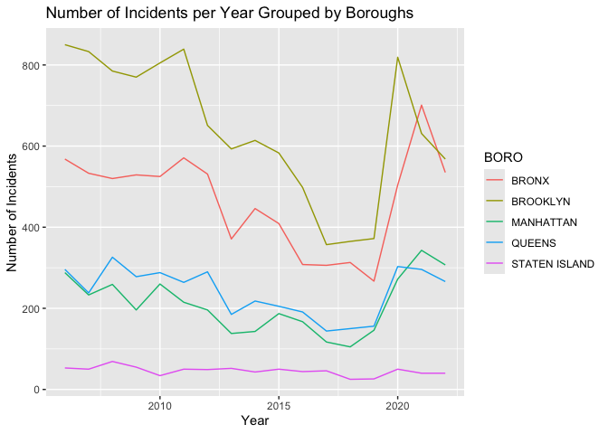

NYPD Gun Violence
================
Benji Edwards
2024-03-03

#### This report is a brief analysis on the NYPC Shooting Incident Data over time, and demonstrates the data science process:

#### 1. Import

#### 2. Tidy

#### 3. Transform, Visualize & Model

#### 4. Communicate

# 1. Import

Let’s start by importing our libraries and data

``` r
library(tidyverse)
```

    ## ── Attaching core tidyverse packages ──────────────────────── tidyverse 2.0.0 ──
    ## ✔ dplyr     1.1.4     ✔ readr     2.1.5
    ## ✔ forcats   1.0.0     ✔ stringr   1.5.1
    ## ✔ ggplot2   3.5.0     ✔ tibble    3.2.1
    ## ✔ lubridate 1.9.3     ✔ tidyr     1.3.1
    ## ✔ purrr     1.0.2     
    ## ── Conflicts ────────────────────────────────────────── tidyverse_conflicts() ──
    ## ✖ dplyr::filter() masks stats::filter()
    ## ✖ dplyr::lag()    masks stats::lag()
    ## ℹ Use the conflicted package (<http://conflicted.r-lib.org/>) to force all conflicts to become errors

Load the NYPD Shooting Incident Data (Historic), which comes from the
NYPD website (also posted on data.gov), and is a list of every shooting
incident that occurred in NYC since 2006.

``` r
nypd_csv <- "https://data.cityofnewyork.us/api/views/833y-fsy8/rows.csv?accessType=DOWNLOAD"
nypd_df <- read_csv(nypd_csv)
```

    ## Rows: 27312 Columns: 21
    ## ── Column specification ────────────────────────────────────────────────────────
    ## Delimiter: ","
    ## chr  (12): OCCUR_DATE, BORO, LOC_OF_OCCUR_DESC, LOC_CLASSFCTN_DESC, LOCATION...
    ## dbl   (7): INCIDENT_KEY, PRECINCT, JURISDICTION_CODE, X_COORD_CD, Y_COORD_CD...
    ## lgl   (1): STATISTICAL_MURDER_FLAG
    ## time  (1): OCCUR_TIME
    ## 
    ## ℹ Use `spec()` to retrieve the full column specification for this data.
    ## ℹ Specify the column types or set `show_col_types = FALSE` to quiet this message.

# 2. Tidy

Now that we have the data, let’s inspect nypd_df and clean up the
dataframe.

``` r
# Total number of rows in our data:
nrow(nypd_df)
```

    ## [1] 27312

``` r
# Preview of our data:
head(nypd_df)
```

    ## # A tibble: 6 × 21
    ##   INCIDENT_KEY OCCUR_DATE OCCUR_TIME BORO     LOC_OF_OCCUR_DESC PRECINCT
    ##          <dbl> <chr>      <time>     <chr>    <chr>                <dbl>
    ## 1    228798151 05/27/2021 21:30      QUEENS   <NA>                   105
    ## 2    137471050 06/27/2014 17:40      BRONX    <NA>                    40
    ## 3    147998800 11/21/2015 03:56      QUEENS   <NA>                   108
    ## 4    146837977 10/09/2015 18:30      BRONX    <NA>                    44
    ## 5     58921844 02/19/2009 22:58      BRONX    <NA>                    47
    ## 6    219559682 10/21/2020 21:36      BROOKLYN <NA>                    81
    ## # ℹ 15 more variables: JURISDICTION_CODE <dbl>, LOC_CLASSFCTN_DESC <chr>,
    ## #   LOCATION_DESC <chr>, STATISTICAL_MURDER_FLAG <lgl>, PERP_AGE_GROUP <chr>,
    ## #   PERP_SEX <chr>, PERP_RACE <chr>, VIC_AGE_GROUP <chr>, VIC_SEX <chr>,
    ## #   VIC_RACE <chr>, X_COORD_CD <dbl>, Y_COORD_CD <dbl>, Latitude <dbl>,
    ## #   Longitude <dbl>, Lon_Lat <chr>

``` r
# Column names that we're working with:
colnames(nypd_df)
```

    ##  [1] "INCIDENT_KEY"            "OCCUR_DATE"             
    ##  [3] "OCCUR_TIME"              "BORO"                   
    ##  [5] "LOC_OF_OCCUR_DESC"       "PRECINCT"               
    ##  [7] "JURISDICTION_CODE"       "LOC_CLASSFCTN_DESC"     
    ##  [9] "LOCATION_DESC"           "STATISTICAL_MURDER_FLAG"
    ## [11] "PERP_AGE_GROUP"          "PERP_SEX"               
    ## [13] "PERP_RACE"               "VIC_AGE_GROUP"          
    ## [15] "VIC_SEX"                 "VIC_RACE"               
    ## [17] "X_COORD_CD"              "Y_COORD_CD"             
    ## [19] "Latitude"                "Longitude"              
    ## [21] "Lon_Lat"

I see some nulls across some columns, let’s see how many null values
exist in our data

``` r
# Let's represent the number of nulls in our data as a percentage:
not_null <- sum(!is.na(nypd_df))
not_null
```

    ## [1] 479387

``` r
is_null <- sum(is.na(nypd_df))
is_null
```

    ## [1] 94165

``` r
pct_null <- (is_null/not_null)*100
pct_null
```

    ## [1] 19.64279

About **20%** of our data has null values. Let’s drop nulls and only
include columns we’re interested in. From our brief inspection, **a
question that comes to mind is the number of incidents that occur in
each borough over time.**

``` r
# Select only the columns we're interested in:
clean_nypd_df <- select(nypd_df, OCCUR_DATE, OCCUR_TIME, BORO, STATISTICAL_MURDER_FLAG, PERP_RACE, PERP_SEX)

# Drop any null dates, as we want to look at trends over time:
clean_nypd_df <- clean_nypd_df %>%
  filter(!is.na(OCCUR_DATE) & !is.na(BORO))

# Reinspect data to see how the shape has changed:
nrow(clean_nypd_df)  
```

    ## [1] 27312

``` r
head(clean_nypd_df)
```

    ## # A tibble: 6 × 6
    ##   OCCUR_DATE OCCUR_TIME BORO     STATISTICAL_MURDER_FLAG PERP_RACE PERP_SEX
    ##   <chr>      <time>     <chr>    <lgl>                   <chr>     <chr>   
    ## 1 05/27/2021 21:30      QUEENS   FALSE                   <NA>      <NA>    
    ## 2 06/27/2014 17:40      BRONX    FALSE                   <NA>      <NA>    
    ## 3 11/21/2015 03:56      QUEENS   TRUE                    <NA>      <NA>    
    ## 4 10/09/2015 18:30      BRONX    FALSE                   <NA>      <NA>    
    ## 5 02/19/2009 22:58      BRONX    TRUE                    BLACK     M       
    ## 6 10/21/2020 21:36      BROOKLYN TRUE                    <NA>      <NA>

``` r
# Inspect the types of data we're working with:
str(clean_nypd_df)
```

    ## tibble [27,312 × 6] (S3: tbl_df/tbl/data.frame)
    ##  $ OCCUR_DATE             : chr [1:27312] "05/27/2021" "06/27/2014" "11/21/2015" "10/09/2015" ...
    ##  $ OCCUR_TIME             : 'hms' num [1:27312] 21:30:00 17:40:00 03:56:00 18:30:00 ...
    ##   ..- attr(*, "units")= chr "secs"
    ##  $ BORO                   : chr [1:27312] "QUEENS" "BRONX" "QUEENS" "BRONX" ...
    ##  $ STATISTICAL_MURDER_FLAG: logi [1:27312] FALSE FALSE TRUE FALSE TRUE TRUE ...
    ##  $ PERP_RACE              : chr [1:27312] NA NA NA NA ...
    ##  $ PERP_SEX               : chr [1:27312] NA NA NA NA ...

The ‘OCCUR_DATE’ column is in character format. Let’s convert this to a
date.

``` r
# Convert our string data to a date:
clean_nypd_df <- clean_nypd_df %>%
  mutate(OCCUR_DATE = as.Date(OCCUR_DATE, format = "%m/%d/%Y"))
# Datatype after cleaning:
typeof(clean_nypd_df$OCCUR_DATE)
```

    ## [1] "double"

# 3. Transform, Visualize & Model

Let’s see how many incidents happen overall in each borough:

``` r
# Group by borough and count the number of rows will give us the number of shooting per borough
total_boro_incidents <- nypd_df %>%
  group_by(BORO) %>%
  summarize(count = n())
print(total_boro_incidents)
```

    ## # A tibble: 5 × 2
    ##   BORO          count
    ##   <chr>         <int>
    ## 1 BRONX          7937
    ## 2 BROOKLYN      10933
    ## 3 MANHATTAN      3572
    ## 4 QUEENS         4094
    ## 5 STATEN ISLAND   776

``` r
ggplot(total_boro_incidents, aes(x = BORO, y = count)) +
  geom_bar(stat = "identity") +
  labs(title = "Total Number of Incidents by Borough",
       x = "Borough",
       y = "Total Number of Incidents")
```

<!-- -->

I want to observe incidents for each borough over time. I wonder what
the date range is.

``` r
# Find our min and max dates, and then find the difference between them:
min_date <- min(clean_nypd_df$OCCUR_DATE)
max_date <- max(clean_nypd_df$OCCUR_DATE)
date_diff <- difftime(max_date, min_date, units = "days")
date_diff
```

    ## Time difference of 6208 days

There are **6208 days** worth of data, so plotting these by days will be
overwhelming. I think **looking at these trends over years would be more
insightful** So let’s create a year column:

``` r
# Create a year column, represented as a date using floor_date() from the lubridate package:
clean_nypd_df$OCCUR_YEAR <- floor_date(clean_nypd_df$OCCUR_DATE, unit = "year")
```

Now that we have years, let’s prep our dataframe for a visualization in
ggplot

``` r
nypd_year <- clean_nypd_df %>%
  group_by(BORO, OCCUR_YEAR) %>%
  summarise(NUM_INCIDENTS = n())
```

    ## `summarise()` has grouped output by 'BORO'. You can override using the
    ## `.groups` argument.

``` r
# Plot the data using ggplot
ggplot(nypd_year, aes(x = OCCUR_YEAR, y = NUM_INCIDENTS, color = BORO)) +
  geom_line() +
  labs(title = "Number of Incidents per Year Grouped by Boroughs", x = "Year", y = "Number of Incidents")
```

<!-- -->

# Communicate

In this analysis of NYPD Shooting Incidents, we observe that Brooklyn
and the Bronx have the highest number of shootings (10,9333 and 7,937
respectively) since 2006. More research should be conducted on various
demographic, economic and environmental factors that may lead to gun
violence in these areas.

As we look at trends over time, we can see that incidents were declining
overall until sometime between 2015 and 2020. At that time, the number
of incidents and suddenly spiked across all boroughs. Then the number of
shooting incidents declines again after 2020, when lock downs occurred,
which may explain the decline in shootings. However, research should be
conducted between 2015 and 2020 to explain the rising shooting
incidents.

Possible bias that may have been introduced into this data set may come
from areas that are more heavily policed. Accordingly, other boroughs
that do not have as large of a law-enforcement presence may be
under-reporting incidents. In other words, more police officers in an
area means more availability to respond to and report shooting
incidents.

``` r
sessionInfo()
```

    ## R version 4.3.2 (2023-10-31)
    ## Platform: x86_64-apple-darwin20 (64-bit)
    ## Running under: macOS Monterey 12.6.7
    ## 
    ## Matrix products: default
    ## BLAS:   /Library/Frameworks/R.framework/Versions/4.3-x86_64/Resources/lib/libRblas.0.dylib 
    ## LAPACK: /Library/Frameworks/R.framework/Versions/4.3-x86_64/Resources/lib/libRlapack.dylib;  LAPACK version 3.11.0
    ## 
    ## locale:
    ## [1] en_US.UTF-8/en_US.UTF-8/en_US.UTF-8/C/en_US.UTF-8/en_US.UTF-8
    ## 
    ## time zone: America/New_York
    ## tzcode source: internal
    ## 
    ## attached base packages:
    ## [1] stats     graphics  grDevices utils     datasets  methods   base     
    ## 
    ## other attached packages:
    ##  [1] lubridate_1.9.3 forcats_1.0.0   stringr_1.5.1   dplyr_1.1.4    
    ##  [5] purrr_1.0.2     readr_2.1.5     tidyr_1.3.1     tibble_3.2.1   
    ##  [9] ggplot2_3.5.0   tidyverse_2.0.0
    ## 
    ## loaded via a namespace (and not attached):
    ##  [1] bit_4.0.5         gtable_0.3.4      highr_0.10        crayon_1.5.2     
    ##  [5] compiler_4.3.2    tidyselect_1.2.0  parallel_4.3.2    scales_1.3.0     
    ##  [9] yaml_2.3.8        fastmap_1.1.1     R6_2.5.1          labeling_0.4.3   
    ## [13] generics_0.1.3    curl_5.2.1        knitr_1.45        munsell_0.5.0    
    ## [17] pillar_1.9.0      tzdb_0.4.0        rlang_1.1.3       utf8_1.2.4       
    ## [21] stringi_1.8.3     xfun_0.41         bit64_4.0.5       timechange_0.3.0 
    ## [25] cli_3.6.2         withr_3.0.0       magrittr_2.0.3    digest_0.6.34    
    ## [29] grid_4.3.2        vroom_1.6.5       rstudioapi_0.15.0 hms_1.1.3        
    ## [33] lifecycle_1.0.4   vctrs_0.6.5       evaluate_0.23     glue_1.7.0       
    ## [37] farver_2.1.1      fansi_1.0.6       colorspace_2.1-0  rmarkdown_2.25   
    ## [41] tools_4.3.2       pkgconfig_2.0.3   htmltools_0.5.7
